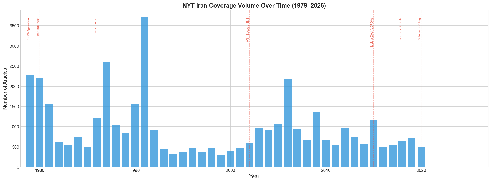
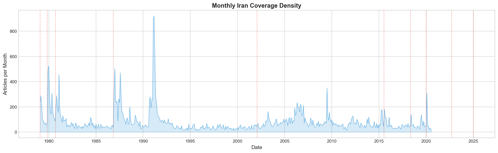
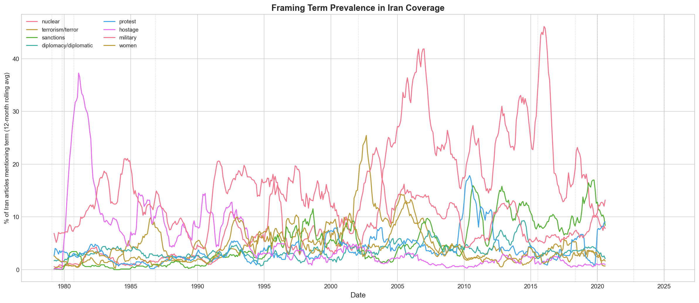
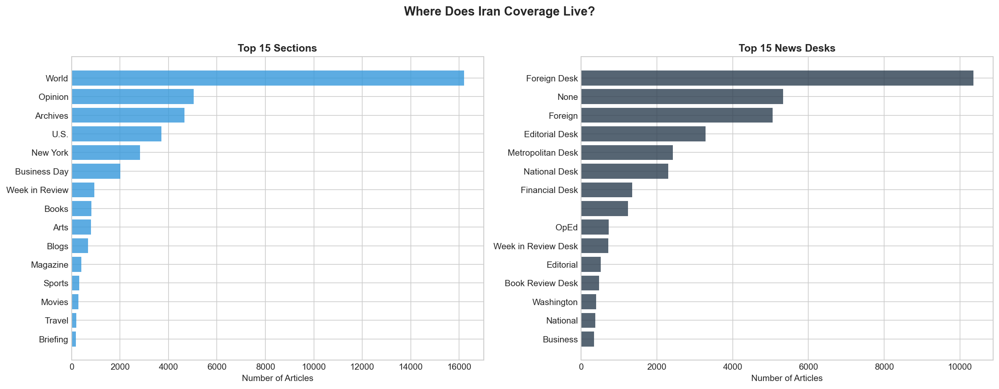
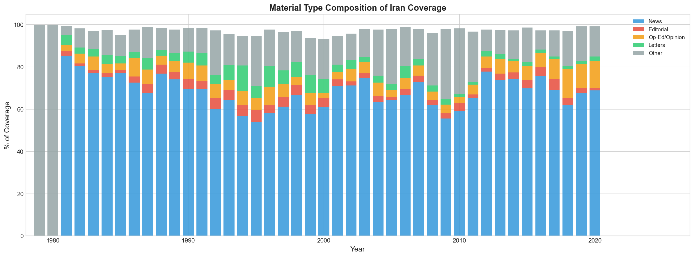
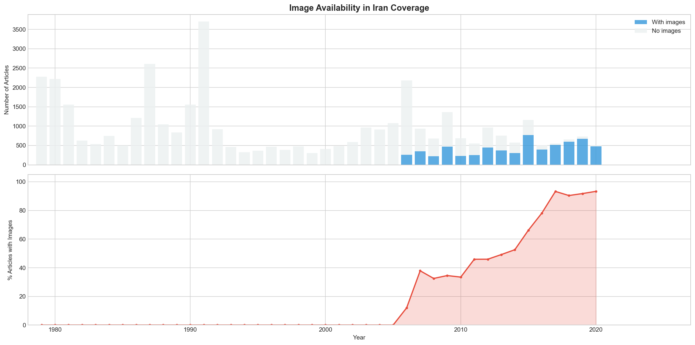
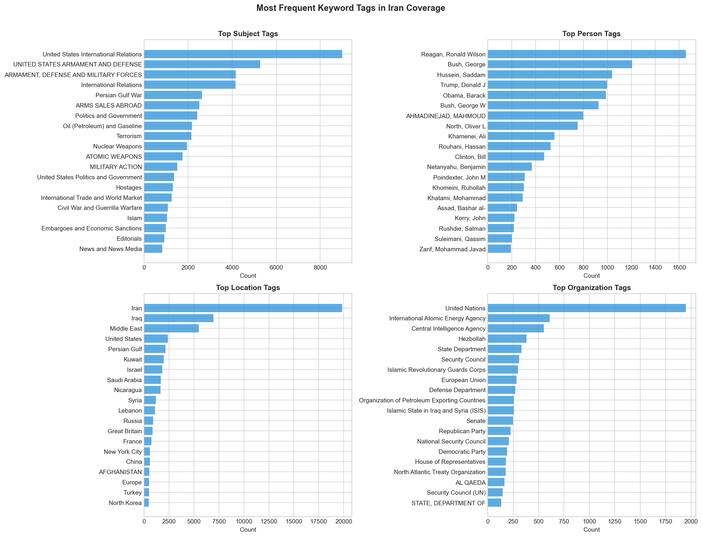
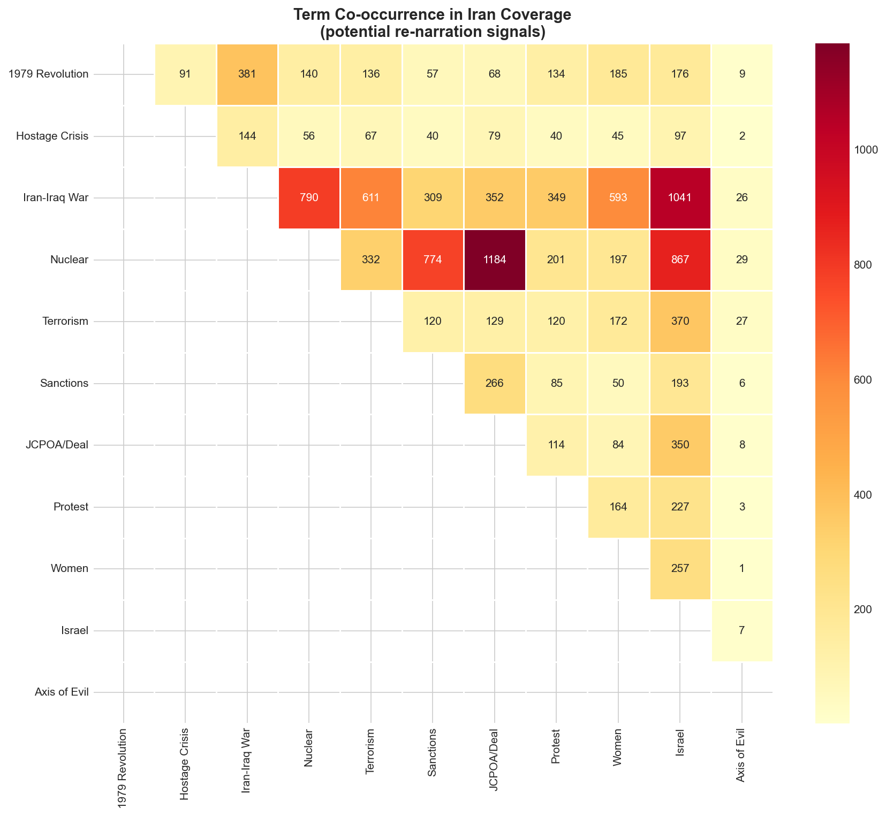

# EDA Findings: Framing Iran in the New York Times (1979–2020)

**Corpus:** 40,381 Iran-related articles filtered from 4,025,772 total NYT articles  
**Period covered:** January 1979 – July 2020 (499 months)  
**Data source:** NYT Archive API  

---

## Corpus Summary Statistics

| Metric | Value |
|--------|-------|
| Total articles | 40,381 |
| Date range | 1979-01-01 to 2020-07-30 |
| Articles with images | 6,329 (15.7%) |
| Average word count | 742 |
| Unique sections | 56 |

### Articles by Period

| Period | Years | Articles | Per Year |
|--------|-------|----------|----------|
| Revolution & Hostage Crisis | 1979–1981 | 6,047 | 2,016 |
| Iran-Iraq War | 1980–1988 | 11,057 | 1,229 |
| Post-Cold-War / 1990s | 1989–2000 | 10,213 | 851 |
| Post-9/11 Era | 2001–2014 | 12,719 | 908 |
| Nuclear Deal Era | 2015–2017 | 2,218 | 739 |
| Trump Max Pressure | 2018–2020 | 1,897 | 474 |

### Top 10 Sections

| Section | Count |
|---------|-------|
| World | 16,196 |
| Opinion | 5,049 |
| Archives | 4,652 |
| U.S. | 3,716 |
| New York | 2,826 |
| Business Day | 2,018 |
| Week in Review | 948 |
| Books | 813 |
| Arts | 796 |
| Blogs | 679 |

### Top 10 Material Types

| Type | Count |
|------|-------|
| News | 24,432 |
| Archives | 4,487 |
| Op-Ed | 2,165 |
| Summary | 1,629 |
| Letter | 1,453 |
| Editorial | 1,160 |
| Review | 799 |
| Correction | 455 |
| Video | 386 |
| Text | 342 |

---

## Figures

### 1. Yearly Coverage Volume

- Massive 1980s peak (Iran-Iraq War): 3,700+ articles in 1988
- Revolution/Hostage Crisis spike (1979–81): ~2,200+/year
- Post-9/11 surge (2006–07): 2,100+ articles
- Post-2010 decline to 500–700/year

### 2. Monthly Coverage Density

### 3. Framing Term Prevalence (12-month rolling avg)

**Key framing shifts:**
- "Hostage" peaks at ~37% of all Iran articles (1980–81)
- "Nuclear" rises from near-zero to 45% dominance (2003–2020)
- "Military" consistent at 15–20% during conflict periods
- "Sanctions" emerges post-2006, grows to ~15%
- "Diplomacy" consistently marginal (3–7%)
- "Protest" spikes around Green Movement (2009) and 2018

### 4. Section & News Desk Distribution

### 5. Material Type Composition Over Time

- News articles dominate (60–85%) but Op-Ed/Opinion share grows over time
- Editorial pieces most visible during crisis periods

### 6. Image Availability

- No images before ~2004 in API metadata
- Post-2016: 90%+ articles have images
- RQ3 (image–text alignment) should focus on 2004–2020

### 7. Top Keyword Tags

- **Persons:** Reagan (1,600+), Bush Sr., Saddam Hussein, Trump, Obama
- **Organizations:** UN, IAEA, CIA, Hezbollah, State Dept
- **Locations:** Iraq co-occurs heavily, then Middle East, US, Israel
- **Subjects:** "US International Relations" is #1

### 8. Term Co-occurrence (Re-narration Signals)

- Nuclear × JCPOA/Deal: 1,184 (strongest)
- Iran-Iraq War × Nuclear: 790
- Nuclear × Israel: 867
- 1979 Revolution × Hostage Crisis: 381
