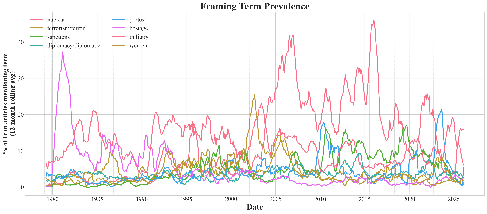
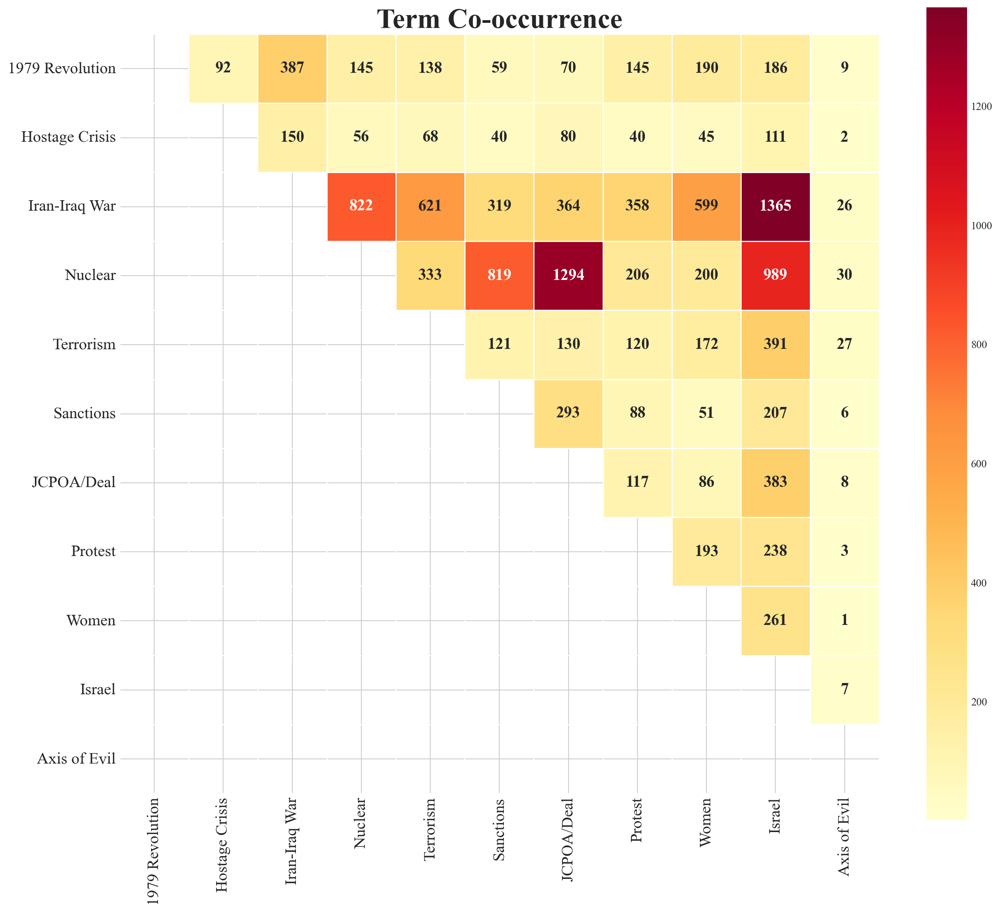

# Part 4: How We Envisage Working with the Data

---

## Slide 1 — What the Data Already Reveals

> Frame succession: hostage (37%) → nuclear (45%) → Israel (49%); diplomacy never exceeds 7%.

<!-- SPEAKING NOTES:
Before explaining our methods, let me show you what the data already tells us.
This figure tracks keyword prevalence across 43,000 Iran articles using a 12-month rolling average.
You can clearly see frame succession — "hostage" dominates in 1980, "nuclear" takes over post-2003, and "Israel" surges in 2024.
But the most striking finding: "diplomacy" stays flat below 7% across ALL periods — even during the actual nuclear deal negotiations.
This asymmetry is exactly what Said diagnosed qualitatively — now we can measure it.
-->

---

## Slide 2 — Envisaged Methods

| Research Question | Method |
|---|---|
| **RQ1** Frame Discontinuities | BERTopic (dynamic topic modeling) + sentiment analysis + structural break detection |
| **RQ2** Re-narration | Keyword co-occurrence analysis across temporal layers |
| **RQ3** Genre & Theme | News vs. opinion comparison via section metadata; visual–textual cross-tabulation |

<!-- SPEAKING NOTES:
We plan four main analytical approaches.
For RQ1 — whether framing breaks align with geopolitical turning points — we'll use BERTopic to track topic evolution, transformer-based sentiment analysis on headlines, and structural break detection to find statistically significant shifts.
For RQ2 — re-narration — we look at how vocabulary applied to PAST events changes when they're referenced in LATER articles.
For RQ3 — genre and thematic framing — we compare news vs. opinion sections and cross-tabulate image content with textual framing scores.
-->

---

## Slide 3 — Re-narration Evidence & Test Cases

**Test cases:**
- 2022 WLF protests → shift toward civil rights framing?
- 2024–25 Israel–Iran → new dominant frame, or new narrative structure?

<!-- SPEAKING NOTES:
This co-occurrence heatmap already hints at re-narration.
387 articles link "revolution" with "hostage" — expected, they happened together.
But 145 articles link "revolution" with "nuclear" — events separated by 25 years. This suggests past events are retroactively absorbed into later threat frames.
Our two critical test cases going forward are the 2022 Women-Life-Freedom protests — do they finally shift framing toward civil rights? — and the 2024-25 direct Iran-Israel confrontation — does "Israel" become a permanent new dominant frame, or does something entirely new emerge?
These will test whether the frame-succession pattern we've identified continues or breaks.
-->
